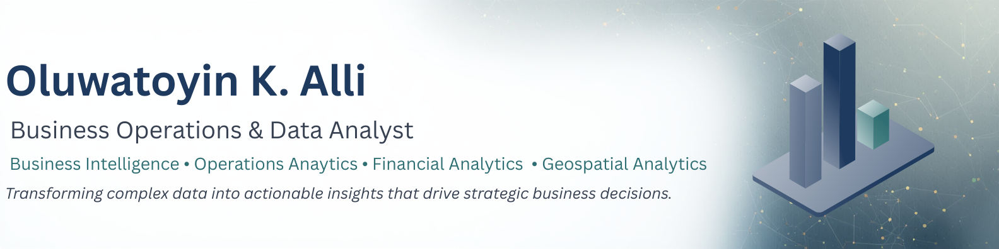
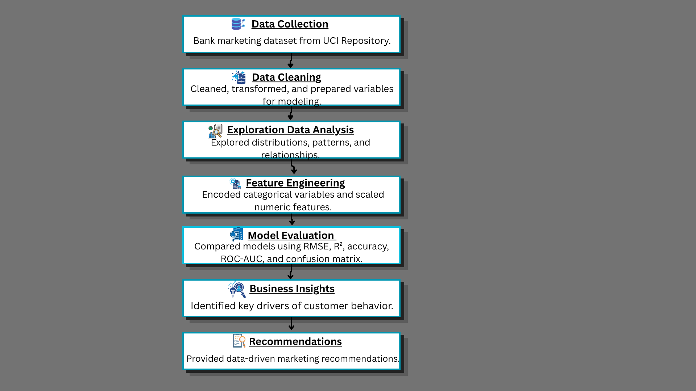

  

# About Me

Hello, I'm **Oluwatoyin K. Alli**, an MBA-trained Business Operations & Data Analyst with an M.S. in Business Analytics and a multidisciplinary background spanning business operations, financial analytics, healthcare operations, and geospatial analytics.

I specialize in transforming complex data into actionable insights that improve operational performance, support strategic decision-making, and solve real-world business challenges. My work combines business intelligence, predictive analytics, dashboard development, financial analysis, and process improvement to help organizations make informed decisions.

This portfolio highlights end-to-end analytics projects across healthcare, finance, business operations, and geospatial analytics, demonstrating practical applications of data analytics from data preparation and modeling to visualization, business insights, and strategic recommendations.

# Why Analytics Matters

Every organization generates data, but data alone does not create value. The true value of analytics lies in transforming raw information into meaningful insights that support informed decision-making, improve operational efficiency, and drive measurable business outcomes.

Across industries such as healthcare, finance, energy, transportation, and public services, analytics enables organizations to identify trends, optimize processes, forecast future performance, manage risk, and uncover opportunities for innovation. From executive dashboards and financial reporting to predictive modeling and geospatial analysis, analytical solutions help leaders make confident, evidence-based decisions.

The projects in this portfolio demonstrate how data can be transformed into practical solutions through business intelligence, statistical analysis, machine learning, data visualization, and geospatial analytics. Each project is designed with a focus on solving real-world business challenges and delivering actionable recommendations.

# 🔄 End-to-End Analytics Workflow

Every project in this portfolio follows a structured, business-focused analytics methodology that transforms raw data into actionable business insights and strategic recommendations.

  

<!--
**OluwatoyinKalli/OluwatoyinKalli** is a ✨ _special_ ✨ repository because its `README.md` (this file) appears on your GitHub profile.

Here are some ideas to get you started:

- 🔭 I’m currently working on ...
- 🌱 I’m currently learning ...
- 👯 I’m looking to collaborate on ...
- 🤔 I’m looking for help with ...
- 💬 Ask me about ...
- 📫 How to reach me: ...
- 😄 Pronouns: ...
- ⚡ Fun fact: ...
-->
