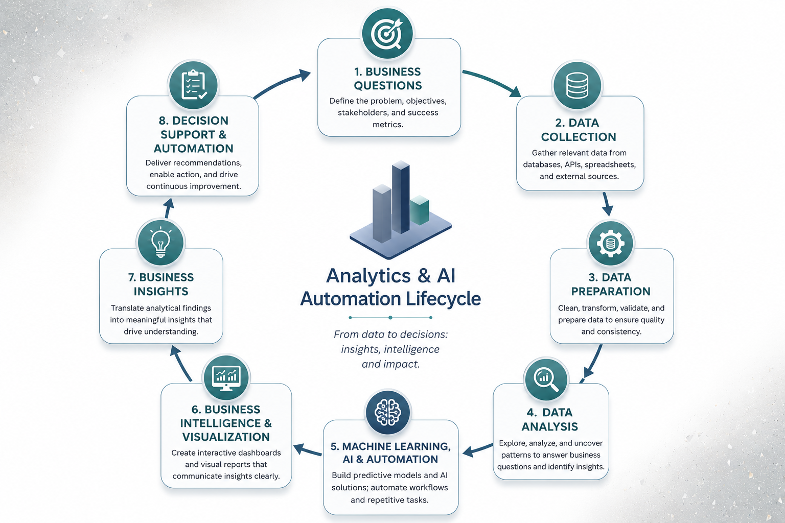

#  About Me

I'm a data & analytics professional who likes turning messy, real-world datasets into decisions people can actually act on.

My background is unusually cross-disciplinary — I started in geoscience, interpreting subsurface data for exploration decisions, before moving into business analytics, financial reporting, and BI. That mix shows up in how I work: I care as much about *whether the data is trustworthy* as I do about the model or dashboard sitting on top of it.

- 🏦 I build end-to-end predictive analytics pipelines — like a customer churn platform on Databricks (Bronze/Silver/Gold architecture, PySpark, MLflow) with a LangChain-powered insights assistant
- 📊 I design BI dashboards that people actually use — Power BI, DAX, Power Query, built for stakeholders who don't want to touch a query
- 🧮 I build statistical & ML models — regression and classification work in R and Python, from GAMs to tuned Random Forest / Gradient Boosted Trees
- 💼 Currently: Business Operations Analyst, building KPI dashboards and predictive models for scheduling and retention

  

  

# What I Do

- Business and Data Analytics
- Business Intelligence and Dashboard Development
- Predictive Analytics and Machine Learning
- AI-Enabled Analytics
- Agentic AI Workflow Development
- Business Process Automation
- Geospatial and Climate Risk Analytics
- Operational and Performance Reporting
- Project Planning and Analytics Delivery

# Why Analytics, AI & Automation Matter

**Why organizations need analytics*
Every organization generates data; customer behavior, transactions, campaign responses but data alone doesn't create value. Without analytics, organizations are left making decisions based on intuition or broad assumptions, which leads to wasted resources, missed opportunities, and inefficient targeting. Analytics turns raw data into evidence, allowing organizations to understand what is happening and why, rather than guessing.

**Why AI is changing analytics*
Traditional analytics often stopped at descriptive reporting, summarizing what already happened. AI and machine learning push analytics further, enabling organizations to predict future outcomes (e.g., which customers are likely to churn, subscribe, or default) and uncover hidden patterns across large, complex datasets that would be impossible to detect manually. This shifts analytics from a rear-view mirror to a forward-looking decision-making tool.

**Why automation matters*
Insights only create value if they can be applied at scale, quickly, and consistently. Automation allows predictive models to be integrated directly into business processes flagging high-potential customers in real time, adjusting campaign targeting automatically, or updating risk scores as new data arrives rather than relying on one-off manual analysis. This reduces operational lag and ensures decisions stay data-driven as conditions change.

**The value I deliver*
I combine technical modeling skills; regression, classification, and model comparison with a business-first mindset: every model I build is designed to answer a specific operational question and produce insight that can be acted on. My work isn't just about achieving strong model performance; it's about translating that performance into practical recommendations, like which customers to prioritize, what factors drive key outcomes, and how to reduce wasted resources so organizations can move from data to decisions with confidence.

# Analytics & AI Automation Lifecycle

My approach follows an end-to-end lifecycle that integrates business strategy, data analytics, artificial intelligence, and automation to transform data into actionable insights, intelligent solutions, and measurable business outcomes. This lifecycle represents my end-to-end approach to solving business problems. Every project begins by understanding the business objective, followed by data preparation and analysis, applying machine learning and AI where appropriate, communicating insights through business intelligence, and delivering actionable recommendations that support informed decision-making and continuous improvement.

  

#  Featured Projects

## 📊 Business Intelligence

####   Financial & Operational Performance Dashboard

Interactive Power BI dashboard for executive reporting, financial performance analysis, profitability tracking, and operational insights.

####   Skills Demonstrated

- KPI Development
- Financial Analytics
- Dashboard Design
- Business Intelligence

**Tools:**
Power BI • DAX • Excel

🔗 **Repository:** [Financial & Operational Performance Dashboard](https://github.com/OluwatoyinKAlli/Financial-Operational-Performance-Dashboard)

DataCo Dashboard

--

## 🤖 Predictive Analytics & AI

Customer Churn

#### Predictive Customer Analytics for Banking Campaigns

An end-to-end predictive analytics project that applies machine learning to identify customers most likely to subscribe to term deposits. The project includes data preparation, exploratory analysis, feature engineering, model development, evaluation, and actionable business recommendations.

####  Skills Demonstrated
- Predictive Analytics
- Machine Learning
- Classification Modeling
- Feature Engineering
- Model Evaluation
- Business Recommendations

**Tools:**
R • Tidymodels • Quarto • ggplot2 • Machine Learning

🔗 **Repository:** [Predictive Customer Analytics for Banking Campaigns](https://github.com/OluwatoyinKAlli/Predictive-Banking-Analytics)

---
--

## 🌍 Geospatial Analytics

Climate Risk Assessment

---

## 🚀 AI & Project Delivery

AI-Enabled Analytics Project Delivery Framework

#  Technical Skills

### 📊 Analytics & Programming
- Python
- R
- SQL
- DAX
- Excel

### 📈 Business Intelligence
- Power BI
- Tableau
- Plotly
- Streamlit
- Zebra BI

### 🤖 AI & Machine Learning
- ChatGPT
- Claude
- Hugging Face
- LangChain
- CrewAI
- Scikit-learn
- Tidymodels

### ⚡ Automation
- Zapier
- Make
- n8n

### 🌍 Geospatial Analytics
- QGIS
- ArcGIS
- GeoPandas

### 📋 Project Management
- GitHub
- ClickUp
- Jira
- Monday.com

### 💾 Databases
- PostgreSQL
- MySQL
- SQLite

# Certifications

### Professional Certifications

- ☁️ **AWS Cloud Foundations** — AWS Academy *(2025)*
- 🔄 **Certified ScrumMaster (CSM)** — Scrum Alliance *(2025)*
- 📋 **ICAgile Certified Professional (ICP)** — ICAgile *(2022)*

---
Thank you for visiting my GitHub profile. Feel free to explore my repositories to see how I apply analytics, AI, and business strategy to solve real-world problems.

#  GitHub Statistics

  
  

  

Here are some ideas to get you started:

- 💬 Ask me about ...
- 📫 How to reach me: ...
- 😄 Pronouns: ...
- ⚡ Fun fact: ...
-->
